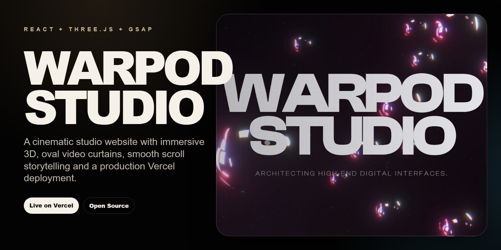
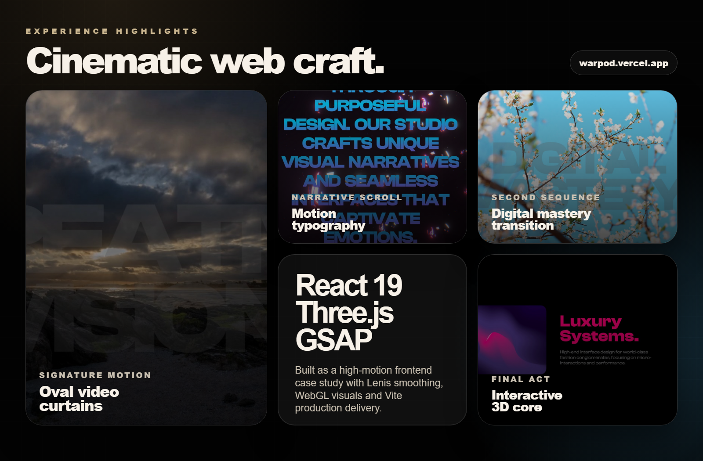
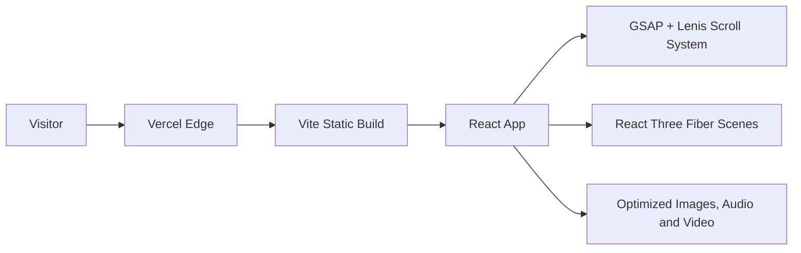

# Warpod Studio

<p align="center">
  <a href="https://warpod.vercel.app">
    
  </a>
</p>

<p align="center">
  <a href="https://warpod.vercel.app"><strong>Live demo</strong></a>
  |
  <a href="#quick-start">Run locally</a>
  |
  <a href="#architecture">Architecture</a>
</p>

<p align="center">
  
  
  
  
  
</p>

Warpod Studio is a cinematic React and Three.js website for a high-end digital studio. It combines WebGL scenes, GSAP scroll choreography, oval video curtain transitions, ambient audio and portfolio-style storytelling into a polished production deployment.

> [!NOTE]
> This repository is built as a frontend experience case study. The best way to evaluate it is to open the live deployment and scroll through the full sequence.

## Preview

<p align="center">
  <a href="https://warpod.vercel.app">
    
  </a>
</p>

<p align="center">
  
</p>

## Experience Highlights

- Cinematic landing sequence with large-format typography and atmospheric 3D visuals.
- Smooth scroll storytelling powered by Lenis, GSAP and ScrollTrigger.
- Oval video curtain transitions for the Creative Vision and Digital Mastery sections.
- Horizontal project showcase with image and video-led panels.
- Interactive 3D Kinetic Core scene built with React Three Fiber and Drei.
- Production deployment on Vercel with strict security headers and optimized runtime video assets.

## Tech Stack

| Layer | Tools |
| --- | --- |
| App | React 19, Vite |
| 3D | Three.js, React Three Fiber, Drei |
| Motion | GSAP, ScrollTrigger, Framer Motion |
| Scroll | Lenis |
| Styling | CSS variables, custom typography, responsive layouts |
| Deployment | Vercel |

## Architecture



## Quick Start

```bash
git clone https://github.com/ikerperez12/warpod.git
cd warpod
npm install
npm run dev
```

Build and validate before publishing:

```bash
npm run lint
npm run build
npm run preview
```

## Production Notes

- Live deployment: [warpod.vercel.app](https://warpod.vercel.app)
- Runtime videos are provided as optimized 1080p assets for smoother scroll playback.
- Security headers are configured in `vercel.json`, including CSP, frame protection, content type protection and referrer policy.
- Presentation assets for this README live in `.github/assets/`, separate from the website runtime assets.

## Repository Status

The public repository is intentionally focused on the production website. It excludes local environment files, deployment state, dependencies, generated build output and internal cleanup artifacts.
